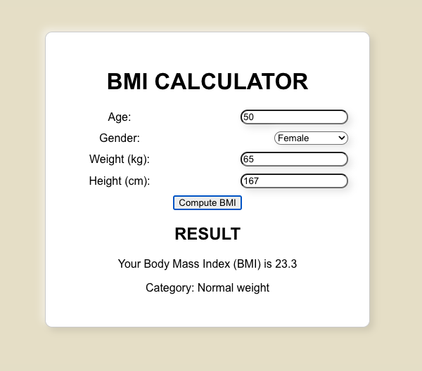

# BMI Calculator

A simple Body Mass Index (BMI) calculator built with React.js. The app computes BMI based on age, gender, weight (in kg), and height (in cm). It also provides information on whether the individual is underweight, within a healthy weight range, overweight, or obese.



## Table of Contents

- [Features](#features)
- [Installation](#installation)
- [Usage](#usage)
- [Deployment](#deployment)
- [License](#license)

## Features

- Neumorphic UI design
- Responsive layout
- Displays BMI category
- Input validation

## Installation

To run the BMI Calculator locally, follow these steps:

1. Clone the repository:

```
git clone https://github.com/yourusername/bmi-calculator.git
```

2. Navigate to the project folder:

```
cd bmi-calculator
```

3. Install the dependencies:

```
npm install
```

## Usage

To start the development server, run:

```
npm start
```

This command will open the app in your default web browser at http://localhost:3000.

## Deployment

To deploy the BMI Calculator, you can use platforms like Netlify, Vercel, or Firebase Hosting.
